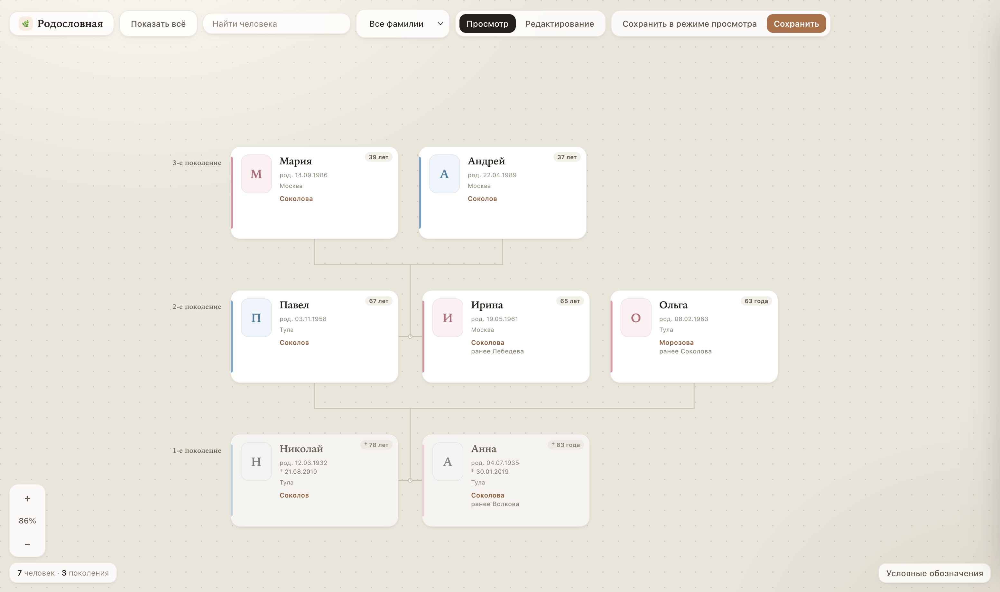

# Родословная

Интерактивное семейное дерево в одном HTML-файле.

Я собирал это дерево для своей семьи: чтобы имена, даты и связи были в одном месте, а родственникам можно было просто открыть файл в браузере. Потом решил оставить проект и здесь - вдруг кому-то пригодится такой же простой способ вести родословную.

Помогал собирать и дорабатывать проект **Claude Opus**.

  

---

## Что внутри

Один файл - `family-tree.html`. Без установки, без сервера, без аккаунтов.

- карточки людей с фото, датами и заметками
- связи: родители, дети, супруги
- поиск и фильтр по фамилии
- режим просмотра и режим редактирования
- сохранение обычного файла или версии «только смотреть» - её удобно отправить родным

В файле лежит небольшой пример семьи, чтобы сразу было видно, как выглядит дерево. Его можно стереть и заполнить своими людьми.

---

## Как открыть

Скачайте репозиторий или откройте файл прямо с компьютера:

1. Откройте `family-tree.html` в браузере (двойной клик или перетащите файл в окно Chrome / Safari / Firefox).
2. Дерево сразу готово к работе.

---

## Как пользоваться

1. Если дерево пустое, нажмите **«Добавить первого человека»** и заполните карточку.
2. На карточке есть кнопки **«+»**:
   - снизу - родители
   - сверху - дети
   - справа - супруг или супруга
3. Клик по карточке открывает панель справа: там можно поправить данные, загрузить фото или удалить человека.
4. По холсту можно ходить мышью, зумить колёсиком или кнопками `+` / `−`.
5. Когда закончите правки, нажмите **«Сохранить»**. Браузер скачает обновлённый HTML - им и пользуйтесь дальше.

Если хотите показать дерево родственникам без риска что-то случайно стереть, нажмите **«Сохранить в режиме просмотра»**. Получится тот же файл, но без кнопок редактирования.

---

## Подсказка

Все данные живут внутри самого HTML. Отдельная база не нужна: просто храните сохранённый файл у себя и, если хотите, в этом репозитории.
